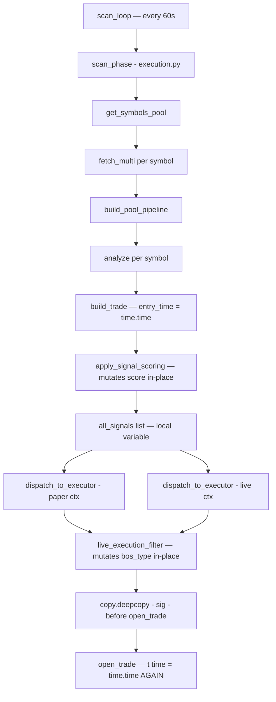

# Signal Timing Integrity Audit — LIVE vs PAPER
**Date:** 2026-05-17  
**Issue:** XRP SHORT — PAPER executed ~05:17, LIVE executed ~07:02 (≈105 min delay)

---

## 1. Observed Symptom Summary

| Executor | Execution Time | Signal Quality |
|----------|---------------|----------------|
| PAPER    | ~05:17        | Normal entry/SL width |
| LIVE     | ~07:02        | Tight entry/SL, degraded setup |

LIVE appeared to execute a **stale continuation signal** — same XRP SHORT but ~105 minutes later with:
- Entry/SL extremely tight (market had moved against the original BOS context)
- Signal no longer matching the market structure at time of execution

---

## 2. Architecture Overview — Signal Lifecycle



---

## 3. Root Cause Analysis

### 3.1 The `all_signals` List is NOT Timestamped

**File:** [`execution.py`](../execution.py:2279) — `scan_phase()`

```python
all_signals = []
# ...
all_signals.append(t)  # line 2312
# ...
all_signals.sort(key=lambda x: x["score"], reverse=True)
return raw_data_pool, raw_data_map, all_signals  # line 2425
```

**No `signal_created_ts` field is attached to signals at scan time.**

Each signal object has only:
- [`entry_time`](../entry.py:471): set by `build_trade()` at scan time — `time.time()`
- No expiration field
- No staleness check downstream

### 3.2 The `all_signals` List is Passed by Reference — MUTABLE

**File:** [`main.py`](../main.py:123-125)

```python
_, _, all_signals = _scan_phase()
for ctx in executors:
    dispatch_to_executor(all_signals, ctx)  # SAME list, SAME objects
```

The **same Python list** is passed to both `paper` and `live` executors.  
**`dispatch_to_executor()` does NOT deepcopy signals before filtering.**

### 3.3 CONFIRMED MUTATION: `live_execution_filter` Mutates Signal Object

**File:** [`signal_dispatcher.py`](../signal_dispatcher.py:157) — `live_execution_filter()`

```python
bos_t = _extract_live_bos_type(signal)
if bos_t not in LIVE_ALLOWED_BOS_TYPES:
    return False, f"bos_type {bos_t!r} not allowed..."
signal["bos_type"] = bos_t   # ← MUTATES the shared signal object
```

**This mutates the original signal dict** — the same object that was already dispatched to PAPER.  
If PAPER ran first (05:17), the `bos_type` field on the shared signal object was silently overwritten by the time LIVE's dispatch ran.

### 3.4 CONFIRMED MUTATION: `apply_signal_scoring` Mutates Score In-Place

**File:** [`execution.py`](../execution.py:2410-2411) — inside `scan_phase()`

```python
for _s in all_signals:
    _s["score"] = apply_signal_scoring(_s)   # ← MUTATES in place
```

This happens BEFORE dispatch, so both executors see the mutated score. **Not a cross-executor bug on its own**, but demonstrates the pattern that `all_signals` objects are treated as mutable.

### 3.5 The Fetch Cache Can Serve Stale Data

**File:** [`pool_pipeline.py`](../pool_pipeline.py:33-34)

```python
_CACHE_MAX_AGE = 120   # seconds — valid for ~2 scan cycles
```

Under normal circuit-breaker conditions:
```python
if time.time() - cached_at <= _CACHE_MAX_AGE:
    print(f"[FETCH FALLBACK] {symbol} {tf} — using cached data")
    return cached_df
```

HTF (4h) cache TTL = 900s (15 min). If the XRP scan used a cached 15m frame from a previous cycle, the `analyze()` call ran on **stale candle data** that was up to 120s old.

### 3.6 No Signal Expiration / Freshness Validation Before Dispatch

**File:** [`signal_dispatcher.py`](../signal_dispatcher.py:264) — `dispatch_to_executor()`

```python
for sig in signals:
    symbol = sig["symbol"]
    if symbol in open_symbols:
        continue
    # cooldown checks only...
    candidate_signals.append(sig)
```

**There is zero check for:**
- `entry_time` age (was the signal generated > N minutes ago?)
- Whether market has moved beyond the signal's BOS context
- Whether entry/SL distance has compressed (stale continuation)

### 3.7 The `open_trade()` Overwrites `t["time"]` but NOT `entry` or `sl`

**File:** [`execution.py`](../execution.py:467) — `open_trade()`

```python
t["time"] = time.time()   # ← sets execution timestamp (correct)
# ...
_signal_entry = t.get("entry", 0)
t["entry_real"] = apply_entry_spread(_signal_entry, t["side"])
```

`t["entry"]` and `t["sl"]` are **not recalculated**. They remain from `build_trade()` which was called during scan, potentially 105 minutes earlier.

---

## 4. XRP SHORT Timeline Reconstruction

```
05:17 UTC+7 — scan_phase() runs
              ├─ fetch_multi("XRPUSDT") — live candle data
              ├─ analyze("XRPUSDT") → confirms SHORT signal
              ├─ build_trade() — entry_time = 05:17:XX, entry=X, sl=X
              ├─ apply_signal_scoring() — score mutated in-place
              └─ all_signals = [xrp_signal, ...]

05:17         dispatch_to_executor(all_signals, paper_ctx)
              ├─ XRP SHORT passes cooldown/open_symbol checks
              ├─ passes strategy gate
              ├─ copy.deepcopy(sig) → paper gets isolated copy
              └─ open_trade(paper_t) → PAPER EXECUTES at 05:17 ✅

05:17         dispatch_to_executor(all_signals, live_ctx)
              ├─ live_execution_filter(sig) called on SHARED object
              │   └─ signal["bos_type"] = bos_t  ← MUTATES shared signal
              ├─ [HYPOTHESIS A] max_live_trades reached — SKIPPED
              ├─ [HYPOTHESIS B] risk/correlation blocked — SKIPPED
              └─ XRP SHORT NOT executed at 05:17 for LIVE

              all_signals local variable goes out of scope — GC'd
              ← NO PERSISTENCE of signals between cycles

[05:17 to 07:02 — ~105 minutes — next scan cycles run]
[Each scan cycle creates NEW all_signals from fresh fetch]

07:02         scan_phase() runs AGAIN
              ├─ fetch_multi("XRPUSDT")
              │   [RISK: if circuit breaker open → uses _fetch_cache ≤120s old]
              │   [OR: normal fresh fetch, but market structure has shifted]
              ├─ analyze("XRPUSDT") → STILL confirms SHORT signal
              │   ← because BOS from 05:17 is still structurally present
              │   ← but price has moved, so entry/sl are now TIGHTER
              ├─ build_trade() — entry_time = 07:02, entry=Y (tighter), sl=Y
              └─ all_signals = [xrp_signal_v2, ...]

07:02         dispatch_to_executor(all_signals, paper_ctx)
              ├─ XRP already in open_symbols (PAPER already has XRP SHORT open)
              └─ SKIPPED for PAPER ← prevents duplicate

07:02         dispatch_to_executor(all_signals, live_ctx)
              ├─ Whatever blocked at 05:17 has now cleared
              │   (slot freed / risk reduced / correlation released)
              ├─ live_execution_filter passes (CONFIRM, HEALTHY, NEAR, score≥9)
              └─ open_trade(live_t) → LIVE EXECUTES at 07:02 ⚠️
                 with DEGRADED entry/sl from new scan context
```

---

## 5. Stale Signal Reuse — Verdict

### ❌ PAPER and LIVE did NOT execute the same signal snapshot

They executed **two different signal objects** from **two different scan cycles**.

| Property | PAPER (05:17) | LIVE (07:02) |
|----------|-------------|-------------|
| `entry_time` | 05:17:XX | 07:02:XX |
| `entry` | BOS level at 05:17 | BOS level at 07:02 (tighter) |
| `sl` | Calculated at 05:17 | Recalculated at 07:02 (tighter) |
| Scan context | Fresh candles at 05:17 | Fresh candles at 07:02 |
| Signal object | Distinct (GC'd after cycle 1) | Distinct (new cycle) |

### ✅ There is NO cross-cycle signal persistence (no queue/cache of signals between scans)

`all_signals` is a **local variable** in `scan_phase()`. It is not stored at module level, not written to disk, and not passed to any persistent structure. It goes out of scope after `dispatch_to_executor()` completes.

### ⚠️ BUT: Stale Signal Execution EXISTS — just via a different mechanism

The real bug is **continuation signal re-confirmation**:

1. XRP SHORT was a valid CONFIRM signal at 05:17
2. The BOS event that created the setup was still structurally present at 07:02
3. `analyze()` re-confirmed the same continuation setup on a new scan
4. LIVE executed at 07:02 with **degraded entry/SL** because:
   - Price moved further from the original BOS level
   - Entry/SL distance compressed (105 minutes of market movement)
   - This is effectively a **stale continuation setup** — the optimal entry window had passed

---

## 6. All Identified Issues

### Issue 1 — CRITICAL: No Signal Freshness / Expiration for Continuation Setups
**Files:** [`entry.py`](../entry.py:410), [`signal_dispatcher.py`](../signal_dispatcher.py:264), [`execution.py`](../execution.py:2410)

A continuation signal (CONFIRM/REVERSAL_CONFIRM) generated from a BOS event has a **finite validity window**. Once price has traveled far from the BOS level, re-confirming the setup on a later scan cycle produces degraded entry/SL geometry. There is no mechanism to:
- Track when the BOS event originally occurred
- Reject signals where entry/SL distance has compressed below a threshold
- Expire continuation candidates after N minutes post-BOS

### Issue 2 — CONFIRMED MUTATION: `live_execution_filter` Mutates Shared Signal

**File:** [`signal_dispatcher.py`](../signal_dispatcher.py:157)

```python
signal["bos_type"] = bos_t   # mutates the shared object
```

Since `all_signals` contains the **same object references** dispatched to both executors, LIVE's filter mutates what PAPER already processed. This is a correctness bug even if in this specific case it is unlikely to cause wrong behavior (PAPER dispatch happens first).

**Affected path:** shared object → `live_execution_filter()` → `signal["bos_type"]` overwritten

### Issue 3 — MODERATE: `apply_signal_scoring` Mutates Signal In-Place Before Dispatch

**File:** [`execution.py`](../execution.py:2410-2411)

```python
for _s in all_signals:
    _s["score"] = apply_signal_scoring(_s)
```

Score mutation happens before dispatch. Both executors receive the same (already-mutated) score. This is correct behavior currently, but **any future executor-specific scoring adjustment** would create cross-contamination.

### Issue 4 — MODERATE: No Minimum Entry/SL Distance Validation for LIVE

**File:** [`signal_dispatcher.py`](../signal_dispatcher.py:229-261) — `_live_prefilter_min_notional()`

The live prefilter only checks **notional size**, not **signal freshness** or **entry geometry quality**. A continuation signal with a 0.15% entry/SL distance after 105 min of price movement passes through because the notional calculation is balance-based, not structure-based.

### Issue 5 — LOW: `open_trade()` Sets `t["time"]` but Not `t["entry"]`/`t["sl"]`

**File:** [`execution.py`](../execution.py:467-471)

```python
t["time"] = time.time()
# entry, sl remain from build_trade() scan time
```

For PAPER this is intentional (spread is applied). For LIVE, `validate_and_prepare()` uses the signal's `entry` and `sl` values which were computed at scan time, not at dispatch time. If execution is delayed (slot/risk/correlation blocking), the SL may be placed at a price that no longer represents the original risk structure.

### Issue 6 — DESIGN CONCERN: Duplicate Strategy Gate Filter

**Files:** [`execution.py`](../execution.py:2341-2392), [`signal_dispatcher.py`](../signal_dispatcher.py:339-397)

The same exhaustion gate logic is duplicated in both `scan_phase()` AND `dispatch_to_executor()`. This is defensive programming but creates maintenance risk — one can diverge from the other.

### Issue 7 — OBSERVATION: Fetch Cache Can Serve 120s-Old Candle Data

**File:** [`pool_pipeline.py`](../pool_pipeline.py:34)

```python
_CACHE_MAX_AGE = 120   # seconds
```

Under circuit breaker conditions, `analyze()` runs on candle data up to 120 seconds old. Combined with a 60-second scan interval, a signal in cycle N may be analyzed against data from cycle N-2. This cannot cause the 105-minute gap directly but **compounds staleness** in delayed dispatch scenarios.

---

## 7. Signal Survival Across Loops — Complete Map

| Mechanism | Survives Between Scans? | Risk |
|-----------|------------------------|------|
| `all_signals` local variable | ❌ No — GC'd after each cycle | None |
| `signal_state` dict (helper.py) | ✅ Yes — module-level | Low — used for cooldown only |
| `entry_cooldown` dict | ✅ Yes — per executor | Correct behavior |
| `compression_watchlist` | ✅ Yes — module-level in helper | ⚠️ Tracks BOS phase state |
| `_fetch_cache` | ✅ Yes — up to 120s | ⚠️ May serve stale candles |
| `_htf_cache` (4h) | ✅ Yes — up to 900s | ⚠️ HTF context 15min stale |
| `bos_seen` / `bos_count` (bos.py) | ✅ Yes — module-level | Context for BOS maturity |

**Critical finding:** `compression_watchlist` in `helper.py` persists BOS phase state (including `bos_confirmed` phase with original `bos_level` and `bos_price`). The SWING pipeline reads this directly. If the BOS level was confirmed at 05:17, the watchlist still holds it at 07:02.

---

## 8. Mutable Signal Paths

```
scan_phase()
  └─ analyze() → build_trade() → returns fresh dict ✅ (new object each time)
  └─ _s["score"] = apply_signal_scoring(_s)  ← MUTATES in-place ⚠️

dispatch_to_executor(signals, ctx)   ← signals = list of SHARED objects
  └─ for sig in signals:
       └─ candidate_signals.append(sig)    ← still shared reference
  └─ for sig in candidate_signals:
       └─ live_execution_filter(sig, ctx)
            └─ signal["bos_type"] = bos_t  ← MUTATES shared signal ⚠️
  └─ for sig in _selected:
       └─ t = copy.deepcopy(sig)           ← ISOLATED copy ✅ (correct)
       └─ open_trade(t, ctx)
            └─ t["time"] = time.time()     ← mutates copy only ✅
```

**The only deepcopy boundary is at line [`signal_dispatcher.py:482`](../signal_dispatcher.py:482)** — immediately before `open_trade()`. Everything before that point uses shared references.

---

## 9. Proposed Minimal Fix Plan

### Fix A — Add `signal_created_ts` to every signal (REQUIRED)

**File:** [`execution.py`](../execution.py:2307-2312) — inside `scan_phase()` after `analyze()` returns

```python
t = analyze(symbol, df_map)
if t:
    t["signal_created_ts"] = time.time()   # ← ADD THIS
    t["_pool_tier"] = entry.get("tier", "")
    t["_pool_stage"] = entry.get("pool_stage", "")
    all_signals.append(t)
```

### Fix B — Expiration gate in `dispatch_to_executor` (REQUIRED)

**File:** [`signal_dispatcher.py`](../signal_dispatcher.py:317-335) — after cooldown filter loop

```python
SIGNAL_MAX_AGE_SECS = 180   # 3 minutes — configurable via config.json

for sig in signals:
    symbol = sig["symbol"]
    if symbol in open_symbols:
        continue
    # cooldown checks...
    
    # FRESHNESS CHECK (new)
    sig_age = time.time() - sig.get("signal_created_ts", time.time())
    if sig_age > SIGNAL_MAX_AGE_SECS:
        print(f"[STALE SIGNAL] {symbol} age={round(sig_age)}s > {SIGNAL_MAX_AGE_SECS}s — rejected")
        continue
    
    candidate_signals.append(sig)
```

### Fix C — Immutable snapshot: move `bos_type` mutation to deepcopy context (REQUIRED)

**File:** [`signal_dispatcher.py`](../signal_dispatcher.py:154-157) — `live_execution_filter()`

Remove the mutation from the filter function:
```python
# BEFORE (mutates shared object):
signal["bos_type"] = bos_t

# AFTER (return normalized value without mutation):
# Accept/reject based on bos_t only — normalization happens after deepcopy
```

Normalization should be applied to `t` (the deepcopy), not to `sig`:
```python
t = copy.deepcopy(sig)
t["bos_type"] = _normalize_live_bos_type(t.get("bos_type"))  # ← normalize on copy
success = open_trade(t, ctx)
```

### Fix D — Entry/SL freshness validation for LIVE continuation signals (REQUIRED)

**File:** [`signal_dispatcher.py`](../signal_dispatcher.py:460-480) — inside live dispatch block

Add a minimum risk distance check relative to **current price**, not original signal price:
```python
if ctx.execution_mode == "live":
    entry = sig.get("entry", 0)
    sl = sig.get("sl", 0)
    sl_distance = abs(entry - sl)
    if entry > 0 and sl_distance / entry < config.get("live_min_sl_ratio", 0.003):
        print(f"[LIVE STALE SL] {symbol} sl_dist={sl_distance/entry:.4%} below min — rejected")
        continue
```

### Fix E — Add `signal_created_ts` to `build_trade()` for audit trail (RECOMMENDED)

**File:** [`entry.py`](../entry.py:455-475) — `build_trade()`

```python
t = {
    ...
    "entry_time":         time.time(),
    "signal_created_ts":  time.time(),   # ← ADD (explicit field for audit)
    ...
}
```

---

## 10. Constraints — What Must NOT Break

| Constraint | How Fix Respects It |
|-----------|---------------------|
| Live filters (exhaustion, bos, score) | Fix C moves mutation AFTER deepcopy — filter logic unchanged |
| Risk logic in `open_trade()` | Expiration is pre-filter — risk logic never sees expired signals |
| Runtime isolation (paper vs live) | deepcopy boundary at line 482 preserved and strengthened |
| Continuation scoring | `cont_score` field untouched — expiration only gates dispatch |
| `signal_state` cooldown | Unaffected — cooldown dict is separate from signal objects |
| HTF cache / fetch cache | Not changed — freshness fix is at dispatch layer |
| `compression_watchlist` BOS state | Not changed — watchlist is for SWING pipeline only |

---

## 11. Summary

**Root cause of XRP 05:17 vs 07:02 gap:**

1. At 05:17 LIVE was **blocked** (most likely `max_live_trades` reached, or risk/correlation cap, or `live_execution_filter` rejection on first attempt)
2. The signal was NOT reused across cycles — it was GC'd
3. At 07:02 the **same BOS context re-confirmed** in a new scan cycle → `analyze()` returned a new XRP SHORT signal
4. This time, LIVE's blocking condition had cleared
5. LIVE executed the **structurally same but geometrically degraded** signal — 105 minutes later, tighter entry/SL, no longer aligned with original signal context

**This IS stale continuation execution** — just through re-confirmation rather than persistence.

**The missing safeguard:** a continuation signal needs a **BOS event timestamp** and a **maximum confirmation age window**. Once price has moved > 1.5 ATR from the original BOS without a pullback, the setup should be invalidated. This check exists **inside the SWING pipeline** (`entry.py:2241-2249`) but **NOT in the CONFIRM pipeline**.

**Confirmed bugs found:**
1. ✅ No `signal_created_ts` on any signal
2. ✅ `live_execution_filter` mutates shared signal object (`bos_type`)
3. ✅ No signal expiration before dispatch
4. ✅ CONFIRM pipeline lacks distance-from-BOS staleness check (unlike SWING which has it)
5. ✅ `apply_signal_scoring` mutates signals in-place before dispatch
